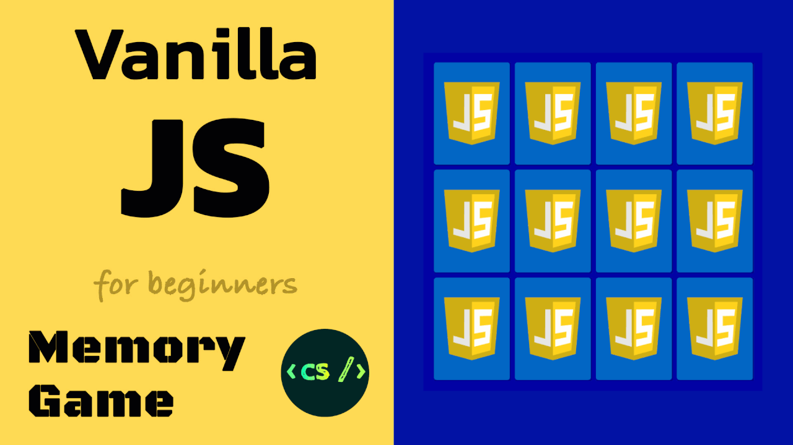

# Memory Game Tutorial - Vanilla JavaScript

* 🕹 Demo: <a href="https://marina-ferreira.github.io/projects/js/memory-game/" target="_blank">Memory Game Project</a>
* 🎬 Video Tutorial: <a href="https://www.youtube.com/watch?v=eMhiMsEC9Uk&list=PLLX1I3KXZ-YH-woTgiCfONMya39-Ty8qw" target="_blank">Code Sketch Channel</a>
* ✏️ Wriiten Tutorial: <a href="https://marina-ferreira.github.io/tutorials/js/memory-game/" target="_blank">Memory Game Tutorial</a>

Project developed in vanilla javascript. Learn the fundamentals of pure javascript in a 30 minute project. No frameworks or libraries, definitely no jQuery.

This tutorial will cover how to:

* select elements in the DOM with querySelector
* iterate through lists with forEach
* add/remove an element class
* add/remove event listeners
* timeout
* html5: data-attribute
* css3: positioning, flexbox, perspective, backface-visibility, transitions

---
💚 [Twitter](https://twitter.com/codesketchlab)
💙 [Facebook](https://www.facebook.com/codesketchlab/)
💜 [Medium](https://medium.com/@marina.ferreira.developer)

Don't forget to subscribe to the >>> 🌹 [Code Sketch Channel](https://www.youtube.com/channel/UCHFmShpjG-8N52O0JD2ut3A) 🌹 <<< 😉

---

